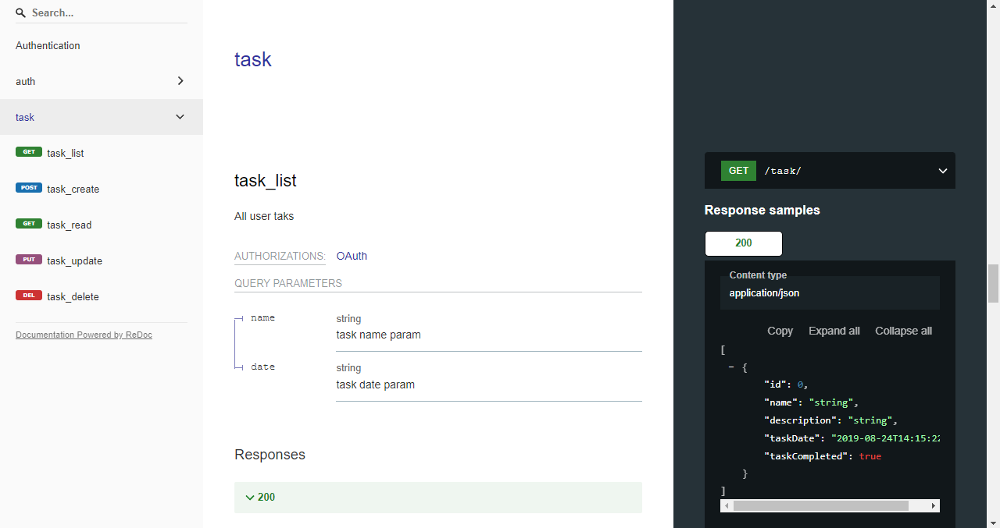

# Task List Management API

## Description

Web application developed with React JS  and Django REST framework for task list management.

The API has the following features: 
[1. Authentication.](#1-authentication) 
[2. Task Management](#2-task-management) 

## Execution
This project was developed using the venv virtual environment, I recommend that you do the same to exult the project, to reduce the chances of error.

### 1. Installation of dependencies
Run the command `pip install -r requirements.txt` in your shell to install the required dependencies.

### 3. Database configuration

#### - SQLite Database
This project uses SQLite, to create the database and tables just run the following commands:  
`python manage.py makemigrations`  
`python manage.py migrate`

### 4. Run server
If the previous steps were successful, just run the command `python manage.py runserver` and open the URL http://127.0.0.1:8000/ in your browser, opening this URL will display the API documentation in your browser with Swagger. You can also access documentation with Redoc at http://127.0.0.1:8000/redoc/

## Website features
All functions for managing tasks require authentication.

### 1. Authentication
When logging in, the authentication token will be returned, which must be sent from the request header as follows:
`Authentication: token <token>`
- User login
- User registration
- User data return
- Editing user data
- User account deletion

### 2. Task Management
- List tasks.
- Task registration.
- Task update.
- Remove task.
- Search task by name or date.

